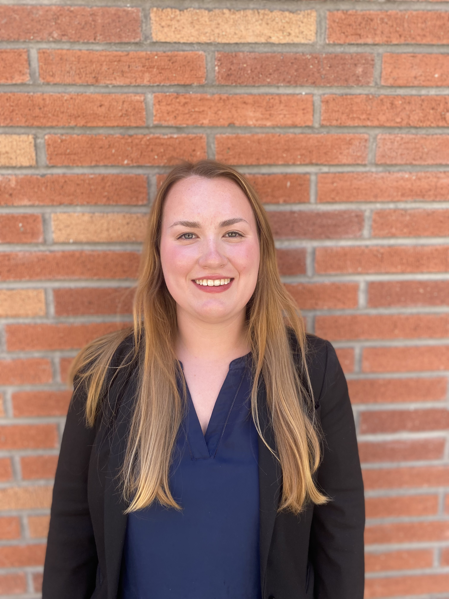

### Education

I am a 2nd year Biostatistics Masters student at Columbia Mailman School of Public Health, concentrating on Public Health Data Science. I graduated from UCLA in 2024 with a Bachelor of Science in Applied Mathematics and a minor in Statistics and Data Science. I am currently looking for full time positions roles upon graduation from my master's program. 

### Work Experience 

I currently work as a student research worker for the Columbia School of Nursing doing social network analysis and data management.  

If you'd like to learn more about my educational and work history visit [this page](about.html)

